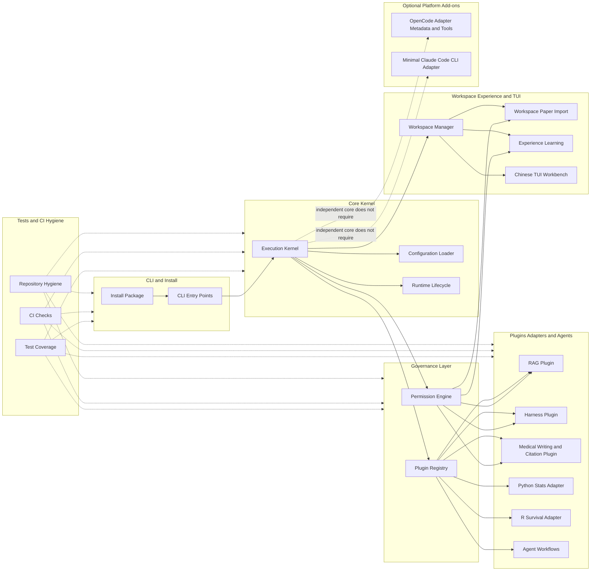
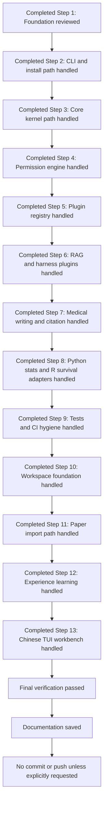

# Execution Roadmap

This document records the current SuperMedicine architecture and the completed execution roadmap state requested by the user. The implementation roadmap is complete at Step 13/13 with final verification passed; Steps 1-13 are historical completion markers, not pending work.

## Current Architecture

## Completed Roadmap Flow

## Project Rule: Planning vs Push Gate

- Plan-stage work does not need strict project-standard verification.
- Optimization and standardization are required before Push/finalization, not during early planning.
- Before any Push, finalization, tag, release, publish, or upload, preserve the final verification requirement: run the project-approved quality gate, perform repository hygiene checks, and resolve required standardization/optimization issues.
- This rule relaxes Plan-phase overhead only; it does not relax the Push-before-finalization gate.

## Release Candidate State

- Release-ready label: `Beta0.3.0`.
- Python package metadata: `0.3.0b0` is the selected PEP 440 fallback because
  packaging validation rejects `Beta0.3.0` as `project.version`.
- R/rpy2 backend: formal support is represented through the optional `r` extra
  and the local `plugins.tools.r_survival` adapter path; it requires a local R
  installation with the R `survival` package available.
- OpencodeR: read-only reference only. No external OpencodeR data or source has
  been copied into this repository, and `D:\GIT\2025\OpencodeR` is not modified.
- CI release gate: Windows, macOS, and Linux must pass before release.
- Release gate checks: `ruff`, `pytest`, wheel/sdist smoke, and repository
  hygiene. The gate intentionally excludes mypy, pyright, and coverage
  fail-under requirements.
- Built artifacts are validation/local release candidates only. They are not
  committed, uploaded, or published.
- No tag, GitHub Release, publish action, PyPI upload, or TestPyPI upload has
  been performed.
- `Planning/NextSteps.md` remains local-only and ignored.
- Documentation model: SuperMedicine is an independent Python medical research
  agent framework. OpenCode and Claude Code are optional add-ons and are not
  prerequisites for core installation, initialization, or CLI/Kernel execution.
- OpenCode status: optional adapter surface with declared tools, plugin metadata,
  skills, and agent role documents; no standalone native OpenCode subagent
  runtime bridge is claimed without an injected SuperMedicine orchestrator.
- Claude Code status: minimal optional adapter for capabilities, runtime status,
  and permission-checked local `claude --print` invocation; no native Claude Code
  skill loading or native subagent dispatch is claimed.

## Remaining Actions

- Documentation is saved in Markdown files and reflects completed Step 13/13 status.
- No commit or push should be performed unless the user explicitly instructs it later.
- No tag, release, publish, or upload should be performed unless the user
  explicitly instructs it later.
- No additional roadmap implementation step is pending in the confirmed scope.
