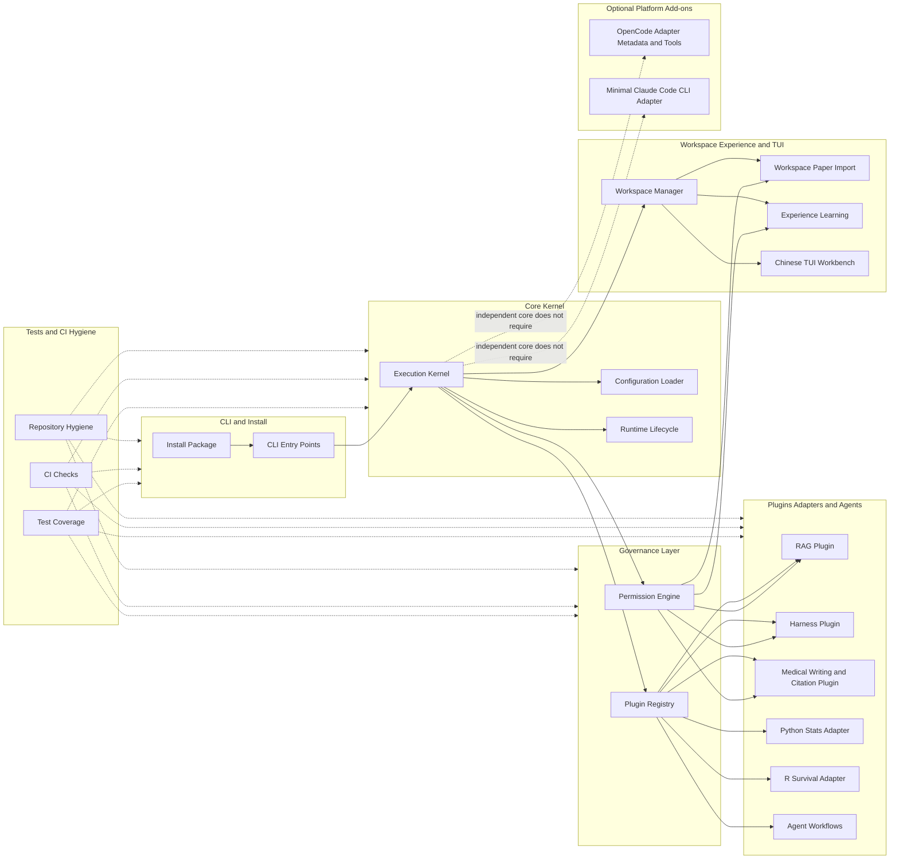
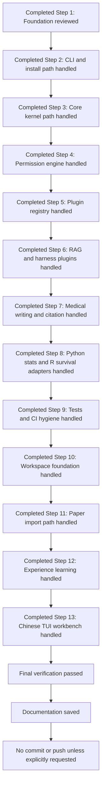

# Execution Roadmap

This document records the current SuperMedicine architecture, historical completion
markers, and the active maintainer-analysis roadmap. Steps 1-13 are historical
completion markers, not pending implementation claims. The current active work is
repository reading, curated function mapping, and scoped planning for future
Nature-Skill, PaperSpine, and Citation-Check-Skill integration analysis. This
artifact is tracked even though `Architecture/` is ignored by default; root
documentation remains the release source of truth.

For current user commands, use [../README.md](../README.md) and
[../guides/INSTALL.md](../guides/INSTALL.md). For detailed component responsibilities, use
[../architecture/ARCHITECTURE.md](../architecture/ARCHITECTURE.md). For maintainer reading results, use
[`MaintainerRepositoryReading.md`](MaintainerRepositoryReading.md). For callable,
side-effect, and impact navigation, use [../architecture/FUNCTION_MAP.md](../architecture/FUNCTION_MAP.md).
This roadmap intentionally keeps curated status, methodology, next actions, and
release/planning gates; it must not contain raw scratch notes, local private
analysis, logs, or generated artifact dumps.

## Current Architecture

## Completed Roadmap Flow

## Project Rule: Planning vs Push Gate

- Plan-stage work does not need strict project-standard verification.
- Optimization and standardization are required before Push/finalization, not during early planning.
- Before any Push, finalization, tag, release, publish, or upload, preserve the final verification requirement: run the project-approved quality gate, perform repository hygiene checks, and resolve required standardization/optimization issues.
- This rule relaxes Plan-phase overhead only; it does not relax the Push-before-finalization gate.

## Release-Candidate State

- Release-ready label: `Beta0.4.2`.
- Python package metadata fallback: `0.4.2b0` is the selected PEP 440-compatible
  value for package metadata.
- R/rpy2 backend: formal support is represented through the optional `r` extra
  and the local `plugins.tools.r_survival` adapter path; it requires a local R
  installation with the R `survival` package available.
- External OpenCode-style references are read-only design references only. No
  external source, data, runtime configuration, or local project path is copied
  into this repository.
- CI release gate: Windows, macOS, and Linux must pass before release.
- Release gate checks: `ruff`, `pytest`, wheel/sdist smoke, and repository
  hygiene. The gate intentionally excludes mypy, pyright, and coverage
  fail-under requirements.
- Built artifacts are validation/local release candidates only. They are not
  committed, uploaded, or published.
- No tag, GitHub Release, publish action, PyPI upload, or TestPyPI upload has
  been performed.
- `Planning/NextSteps.md` remains local-only and ignored.
- Documentation model: SuperMedicine is an independent Python medical research
  agent framework. OpenCode and Claude Code are optional add-ons and are not
  prerequisites for core installation, initialization, or CLI/Kernel execution.
- OpenCode status: optional adapter surface with declared tools, plugin metadata,
  skills, and agent role documents; no standalone native OpenCode subagent
  runtime bridge is claimed without an injected SuperMedicine orchestrator.
- Claude Code status: minimal optional adapter for capabilities, runtime status,
  and permission-checked local `claude --print` invocation; no native Claude Code
  skill loading or native subagent dispatch is claimed.

## Remaining Actions

- Documentation is saved in curated Markdown files and reflects completed Step
  13/13 status for the historical implementation roadmap.
- Active maintainer-analysis work remains pending for deep integration audit and
  optimization planning around Nature-Skill, PaperSpine, and
  Citation-Check-Skill equivalents.
- Future implementation must not claim a tracked Nature-Skill, PaperSpine, or
  Citation-Check-Skill result until the relevant repository anchors have been
  audited, design boundaries have been documented, and implementation has been
  completed in SuperMedicine-native tracked files.
- No commit or push should be performed unless the user explicitly instructs it
  later.
- No tag, release, publish, or upload should be performed unless the user
  explicitly instructs it later.
- No raw/private/transient artifact should be committed, pushed, uploaded, or
  copied into maintainer-facing docs. Only curated, redacted, repository-relevant
  conclusions may be promoted into tracked documentation.

## Current Progress Checkpoints

- Historical Build/implementation roadmap: completed through Step 13/13 and
  documented as a release-candidate state, without any new claim that later
  skill-deep-integration work has already been implemented.
- Repository reading pass: completed against the tracked-file inventory in this
  roadmap, including the self-evolution source and regression-test files now
  tracked by Git.
  Curated results live in
  [`MaintainerRepositoryReading.md`](MaintainerRepositoryReading.md).
- Function/callable mapping: `../architecture/FUNCTION_MAP.md` now combines a maintainer
  curated project map with the AST-generated callable appendix. Treat it as a
  navigation and impact-review aid, not as executable authority.
- Candidate exact-name status: Nature-Skill, PaperSpine, and
  Citation-Check-Skill are not present as tracked exact-name packages or
  implementations. Current anchors are SuperMedicine-native medical writing,
  medical citation, paper import, RAG, workspace, adapter skill, and agent docs.
- Git/document boundary: maintainer-facing tracked docs may record sanitized
  conclusions; ignored scratch notes, local-only planning, generated outputs,
  runtime state, raw audits, private logs, and binary/release artifacts remain
  outside the commit/upload boundary unless explicitly curated and promoted.

## Repository Reading Methodology for Co-Maintainers

1. Start from `git ls-files` and this roadmap's maintained inventory. Treat the
   listed tracked files as the source reading boundary.
2. Include the self-evolution source and regression-test files as normal tracked
   repository inputs: `core/self_evolution.py`, `tests/test_self_evolution.py`,
   and `tests/test_self_evolution_cli.py`.
3. Exclude caches, build outputs, distribution artifacts, egg-info, runtime
   `.supermedicine/` state, local private analysis, raw logs, ignored scratch
   docs, binaries, release bundles, and transient generated files.
4. Read source line by line for purpose, public interfaces, dependencies, data
   flow, side effects, configuration assumptions, and maintenance risks.
5. Reconcile static callable findings with dynamic framework boundaries:
   Textual callbacks, CLI dispatch, decorators, plugin registry loading,
   adapter dispatch, pytest fixtures, and runtime imports can create behavior
   not fully visible in static maps.
6. Promote only curated conclusions into this roadmap,
   [`MaintainerRepositoryReading.md`](MaintainerRepositoryReading.md),
   `../architecture/FUNCTION_MAP.md`, or other tracked maintainer docs. Do not paste raw
   scratch artifacts or private runtime content.

## How to Use `FUNCTION_MAP.md` and `MaintainerRepositoryReading.md`

- Use [`MaintainerRepositoryReading.md`](MaintainerRepositoryReading.md) as the
  reading ledger: it summarizes every included file's purpose, responsibilities,
  public interface, dependencies, data flow, side effects, configuration
  assumptions, and maintenance risks.
- Use [../architecture/FUNCTION_MAP.md](../architecture/FUNCTION_MAP.md) as the impact and call-surface
  guide: begin with the curated sections for architecture, side-effect hotspots,
  candidate skill gaps, and update checklist, then consult the AST callable
  appendix when changing specific functions/classes.
- When planning a change, cross-check both documents before editing: the reading
  report tells what each file is for; the function map shows callable-level
  impact, side-effect hints, and static/dynamic limitations.
- When updating either document, keep exact-name candidate status separate from
  SuperMedicine-native anchors. Do not imply installed external-skill behavior
  unless a tracked implementation actually exists.
- Regenerate or curate map updates only from repository source and sanitized
  maintainer analysis, never from raw runtime logs, local configuration snapshots,
  secrets, private endpoints, API keys, or transient files.

## Short-Term Next-Build Planning Boundary

The next Build planning frame is analysis-first, not implementation-result
claiming. The short-term scope is to audit and optimize deep integration options
for three candidate workstreams:

- **Nature-Skill deep-integration audit/optimization**: compare the existing
  medical-writing checklist modules, reference checklists, citation helpers,
  OpenCode skill docs, and agent role docs against a SuperMedicine-native
  manuscript/submission workflow. Identify missing requirements and safe design
  boundaries before implementing any new skill package or workflow.
- **PaperSpine deep-integration audit/optimization**: compare paper import,
  workspace paper screens, RAG providers, medical writing, citation, and
  workspace tool flows against a possible paper-to-outline-to-evidence spine.
  Document data-model, permission, persistence, and UX gaps before building any
  named PaperSpine workflow.
- **Citation-Check-Skill deep-integration audit/optimization**: compare current
  AMA/Vancouver formatting, source validation/provenance helpers, medical claim
  annotation, RAG/PubMed boundaries, and adapter skill docs against a full
  citation reconciliation/checking workflow. Document external-verification,
  bibliography, in-text citation, permission, and state-management gaps before
  claiming implementation.

Short-term Build outputs should be curated design/audit documents, updated
roadmap/function-map entries, and explicit implementation plans. They should not
claim that Nature-Skill, PaperSpine, or Citation-Check-Skill has been integrated
until code, docs, and verification have been completed in a later approved scope.

## Remaining Integration-Analysis Milestones

1. Reconfirm the Git boundary and tracked/untracked status before each maintainer
   doc update, without committing or pushing unless explicitly instructed.
2. For each candidate workstream, enumerate existing SuperMedicine anchors from
   `FUNCTION_MAP.md` and validate them against the reading report.
3. Produce a gap matrix for required capabilities, current modules, missing
   interfaces, side-effect risks, permission requirements, persistence model,
   user workflow, adapter/platform wording, and verification needs.
4. Convert approved gaps into a Build-ready implementation plan with involved
   files and verification standards.
5. After implementation in a later scope, update this roadmap,
   [`MaintainerRepositoryReading.md`](MaintainerRepositoryReading.md), and
   `../architecture/FUNCTION_MAP.md` to reflect actual tracked results and remove obsolete
   gap wording only where evidence supports the change.

## Maintainer Repository Reading Inventory

This section is the commit/upload-eligible repository inventory artifact for
maintainers. It records the tracked-file reading scope from `git ls-files`, the
self-evolution files included in that tracked scope, explicit exclusions, and
target skill/project candidate anchors. Maintainer-facing repository docs such
as this roadmap and
`../architecture/FUNCTION_MAP.md` are commit/upload eligible. Scratch notes, raw audits,
private analysis, transient runtime logs, local planning files, ignored local
docs, and generated artifacts remain local-only unless a maintainer explicitly
promotes sanitized content into a tracked maintainer document.

Curated results from the line-by-line maintainer reading pass are recorded in
[`MaintainerRepositoryReading.md`](MaintainerRepositoryReading.md). That report
maps every included file below to purpose, responsibilities, public interfaces,
dependencies, data flow, side effects, configuration assumptions, and
maintenance risks while preserving the exclusions in this inventory.

### Required tracked-file reading list (`git ls-files`)

- `.github/workflows/ci.yml`
- `.gitignore`
- `ARCHITECTURE.md`
- `Architecture/ExecutionRoadmap.md`
- `Architecture/MaintainerRepositoryReading.md`
- `Architecture/OptimizationAudit.md`
- `Architecture/PhaseImplementationPlan.md`
- `Architecture/PlatformIntegrationAudit.md`
- `Architecture/RepositoryOptimizationAudit.md`
- `Architecture/WorkspaceTuiRagGuide.md`
- `CHANGELOG.md`
- `CONTRIBUTING.md`
- `Cli.py`
- `FUNCTION_MAP.md`
- `INSTALL.md`
- `Install.py`
- `LICENSE`
- `MANIFEST.in`
- `README.md`
- `SECURITY.md`
- `SECURITY_HARDENING_CHECKLIST.md`
- `Uninstall.py`
- `adapters/__init__.py`
- `adapters/base_adapter.py`
- `adapters/claude_code/SKILL.md`
- `adapters/claude_code/__init__.py`
- `adapters/claude_code/adapter.py`
- `adapters/opencode/__init__.py`
- `adapters/opencode/adapter.py`
- `adapters/opencode/agents/alpha-analyst.md`
- `adapters/opencode/agents/beta-reviewer.md`
- `adapters/opencode/agents/delta-orchestrator.md`
- `adapters/opencode/agents/gamma-writer.md`
- `adapters/opencode/agents/supermedicine.md`
- `adapters/opencode/plugin.json`
- `adapters/opencode/skills/harness-monitor.md`
- `adapters/opencode/skills/medical-citation.md`
- `adapters/opencode/skills/medical-writing.md`
- `adapters/opencode/skills/python-stats.md`
- `adapters/opencode/skills/r-survival.md`
- `adapters/opencode/skills/rag-query.md`
- `adapters/standalone/__init__.py`
- `adapters/standalone/adapter.py`
- `agents/__init__.py`
- `agents/base_agent.py`
- `agents/checkpoint.py`
- `agents/orchestrator.py`
- `agents/state_machine.py`
- `core/__init__.py`
- `core/config_center.py`
- `core/event_bus.py`
- `core/experience.py`
- `core/experiment_guide.py`
- `core/experiment_protocols.py`
- `core/kernel.py`
- `core/llm_client.py`
- `core/llm_manager.py`
- `core/llm_providers/__init__.py`
- `core/llm_providers/base.py`
- `core/llm_providers/config.py`
- `core/llm_providers/openrouter.py`
- `core/log_report.py`
- `core/operation_guard.py`
- `core/paper_import/__init__.py`
- `core/paper_import/enrichment.py`
- `core/paper_import/errors.py`
- `core/paper_import/importer.py`
- `core/paper_import/models.py`
- `core/path_safety.py`
- `core/plugin_registry.py`
- `core/redaction.py`
- `core/self_evolution.py`
- `core/serialization.py`
- `core/session_manager.py`
- `core/time_utils.py`
- `core/token_tracker.py`
- `core/tui/__init__.py`
- `core/tui/app.py`
- `core/tui/app.tcss`
- `core/tui/dialog_history.py`
- `core/tui/i18n.py`
- `core/tui/permissions.py`
- `core/tui/screens/__init__.py`
- `core/tui/screens/chat_view.py`
- `core/tui/screens/dashboard.py`
- `core/tui/screens/dialog_screen.py`
- `core/tui/screens/experience.py`
- `core/tui/screens/experience_screen.py`
- `core/tui/screens/experiment_screen.py`
- `core/tui/screens/llm_screen.py`
- `core/tui/screens/log_screen.py`
- `core/tui/screens/paper_screen.py`
- `core/tui/screens/papers.py`
- `core/tui/screens/permission_screen.py`
- `core/tui/screens/tool_screen.py`
- `core/tui/screens/workspace_screen.py`
- `core/tui/screens/workspaces.py`
- `core/tui/state.py`
- `core/workspace.py`
- `core/workspace_tools.py`
- `install.json`
- `install.py`
- `installer/__init__.py`
- `installer/entrypoint.py`
- `installer/exe_release.py`
- `permission/__init__.py`
- `permission/access_mode.py`
- `permission/audit.py`
- `permission/default_policy.yaml`
- `permission/engine.py`
- `permission/policy.py`
- `permission/prompt_generator.py`
- `plugins/__init__.py`
- `plugins/base_plugin.py`
- `plugins/experiments/cell_culture_basic.yaml`
- `plugins/experiments/western_blot_basic.yaml`
- `plugins/harness/__init__.py`
- `plugins/harness/checkpoint_verifier.py`
- `plugins/harness/main.py`
- `plugins/harness/monitor.py`
- `plugins/harness/plugin.yaml`
- `plugins/rag/__init__.py`
- `plugins/rag/interface.py`
- `plugins/rag/local_provider.py`
- `plugins/rag/main.py`
- `plugins/rag/plugin.yaml`
- `plugins/rag/pubmed_provider.py`
- `plugins/rag/references/provider-interface.md`
- `plugins/standards/__init__.py`
- `plugins/standards/medical_citation/__init__.py`
- `plugins/standards/medical_citation/ama_format.py`
- `plugins/standards/medical_citation/main.py`
- `plugins/standards/medical_citation/plugin.yaml`
- `plugins/standards/medical_citation/utils.py`
- `plugins/standards/medical_citation/vancouver_format.py`
- `plugins/standards/medical_writing/__init__.py`
- `plugins/standards/medical_writing/checklist_base.py`
- `plugins/standards/medical_writing/checklists.py`
- `plugins/standards/medical_writing/main.py`
- `plugins/standards/medical_writing/plugin.yaml`
- `plugins/standards/medical_writing/prisma.py`
- `plugins/standards/medical_writing/references/consort-checklist.md`
- `plugins/standards/medical_writing/references/prisma-checklist.md`
- `plugins/standards/medical_writing/references/stard-checklist.md`
- `plugins/standards/medical_writing/references/strobe-checklist.md`
- `plugins/standards/medical_writing/stard.py`
- `plugins/tools/__init__.py`
- `plugins/tools/_common.py`
- `plugins/tools/experiment_wb/__init__.py`
- `plugins/tools/experiment_wb/main.py`
- `plugins/tools/experiment_wb/plugin.yaml`
- `plugins/tools/python_data_analysis/README.md`
- `plugins/tools/python_data_analysis/runner.py`
- `plugins/tools/python_data_analysis/tool.yaml`
- `plugins/tools/python_stats/__init__.py`
- `plugins/tools/python_stats/main.py`
- `plugins/tools/python_stats/plugin.yaml`
- `plugins/tools/r_data_analysis/README.md`
- `plugins/tools/r_data_analysis/runner.R`
- `plugins/tools/r_data_analysis/tool.yaml`
- `plugins/tools/r_survival/__init__.py`
- `plugins/tools/r_survival/cox_model.py`
- `plugins/tools/r_survival/kaplan_meier.py`
- `plugins/tools/r_survival/logrank.py`
- `plugins/tools/r_survival/main.py`
- `plugins/tools/r_survival/plugin.yaml`
- `plugins/tools/r_template/__init__.py`
- `plugins/tools/r_template/runner.R`
- `plugins/tools/r_template/tool.yaml`
- `pyproject.toml`
- `requirements.txt`
- `setup.py`
- `tests/__init__.py`
- `tests/conftest.py`
- `tests/test_audit.py`
- `tests/test_backward_compatibility.py`
- `tests/test_checkpoint.py`
- `tests/test_checkpoint_verifier.py`
- `tests/test_claude_code_adapter.py`
- `tests/test_config_center.py`
- `tests/test_custom_provider.py`
- `tests/test_event_bus.py`
- `tests/test_experience_cli.py`
- `tests/test_experience_storage.py`
- `tests/test_experiment_cli.py`
- `tests/test_experiment_guide.py`
- `tests/test_experiment_log_integration.py`
- `tests/test_experiment_wb_plugin.py`
- `tests/test_installer_entrypoint.py`
- `tests/test_installer_exe_release.py`
- `tests/test_integration.py`
- `tests/test_kernel.py`
- `tests/test_llm_client.py`
- `tests/test_llm_manager.py`
- `tests/test_local_rag.py`
- `tests/test_log_report.py`
- `tests/test_medical_citation.py`
- `tests/test_medical_writing.py`
- `tests/test_monitor.py`
- `tests/test_opencode_adapter.py`
- `tests/test_operation_guard.py`
- `tests/test_orchestrator.py`
- `tests/test_paper_cli.py`
- `tests/test_paper_import_core.py`
- `tests/test_path_safety.py`
- `tests/test_permission_engine.py`
- `tests/test_permission_modes.py`
- `tests/test_plugin_registry.py`
- `tests/test_policy.py`
- `tests/test_prisma.py`
- `tests/test_prompt_generator.py`
- `tests/test_python_stats.py`
- `tests/test_r_survival.py`
- `tests/test_redaction.py`
- `tests/test_regression_baseline.py`
- `tests/test_release_smoke.py`
- `tests/test_repo_hygiene.py`
- `tests/test_self_evolution.py`
- `tests/test_self_evolution_cli.py`
- `tests/test_session_manager.py`
- `tests/test_standalone_adapter.py`
- `tests/test_stard.py`
- `tests/test_state_machine.py`
- `tests/test_token_tracker.py`
- `tests/test_tui_chat_view.py`
- `tests/test_tui_dashboard.py`
- `tests/test_tui_dialog_history.py`
- `tests/test_tui_entrypoint.py`
- `tests/test_tui_experience_screens.py`
- `tests/test_tui_experiment_screen.py`
- `tests/test_tui_invalid_table_actions.py`
- `tests/test_tui_llm_screen.py`
- `tests/test_tui_log_screen.py`
- `tests/test_tui_paper_screens.py`
- `tests/test_tui_permissions.py`
- `tests/test_tui_state.py`
- `tests/test_tui_workspace_screens.py`
- `tests/test_uninstall.py`
- `tests/test_workspace.py`
- `tests/test_workspace_cli.py`
- `tests/test_workspace_tools.py`

### Self-evolution files included in tracked reading scope

- `core/self_evolution.py` — source file for the self-evolution workstream.
- `tests/test_self_evolution.py` — service-level regression coverage for the
  self-evolution source file.
- `tests/test_self_evolution_cli.py` — CLI-facing regression coverage for the
  self-evolution workstream.

### Exclusions from required reading, with reasons

- `.mypy_cache/` — generated static-analysis cache; reproducible and not source.
- `.ruff_cache/` — generated linter cache; reproducible and not source.
- `__pycache__/` — generated Python bytecode cache; interpreter artifact.
- `build/` — generated build output; recreate from tracked package sources.
- `dist/` — generated distribution artifacts; release candidates only, not source
  of truth.
- `supermedicine.egg-info/` — generated packaging metadata; recreate from
  `pyproject.toml`, `setup.py`, and tracked package files.
- Runtime `.supermedicine/` — local runtime state/config/log storage; may contain
  private machine/user state and is not repository source.
- Release artifacts such as wheels, sdists, archives, installers, checksums, and
  uploaded bundles — generated/published outputs, not required reading inputs.
- Binary artifacts such as executables, compiled objects, images, databases,
  binary caches, and local model/data blobs — not auditable as source in this
  inventory and may be generated, private, or too large for maintainer reading.
- Ignored local docs such as `docs/external-project-analysis.md`,
  `EXTERNAL_PROJECT_ANALYSIS.md`, and `failure_inventory.md` — scratch/raw audit
  material and private/transient analysis; sanitize and promote into a tracked
  maintainer document before treating as commit/upload eligible.
- Scratch/raw audit/private/transient artifacts generally — local-only unless
  explicitly curated, redacted, and moved into tracked maintainer-facing docs.

### Target skill/project candidate findings and anchors

- Nature-Skill: no tracked SuperMedicine file named `Nature-Skill` or
  `Nature Skill` is present in the current tracked inventory. Future
  Nature-inspired work should be implemented in SuperMedicine-native tracked
  files after clean-room design review, not copied from local scratch analysis.
- PaperSpine: no tracked PaperSpine implementation, generated skill package, or
  required PaperSpine workflow artifact is present. Any PaperSpine-related notes
  observed in ignored local docs are local-only analysis and are not repository
  source. Future work should anchor to SuperMedicine-native paper import,
  medical writing, citation, skill, and agent surfaces below.
- Citation-Check-Skill: no tracked SuperMedicine file named
  `Citation-Check-Skill` is present. Existing citation-checking/writing anchors
  are the tracked medical citation and writing plugins plus platform skill docs
  listed below.
- Claude Code skill anchor: `adapters/claude_code/SKILL.md`.
- OpenCode skill anchors: `adapters/opencode/skills/harness-monitor.md`,
  `adapters/opencode/skills/medical-citation.md`,
  `adapters/opencode/skills/medical-writing.md`,
  `adapters/opencode/skills/python-stats.md`,
  `adapters/opencode/skills/r-survival.md`, and
  `adapters/opencode/skills/rag-query.md`.
- OpenCode agent anchors: `adapters/opencode/agents/alpha-analyst.md`,
  `adapters/opencode/agents/beta-reviewer.md`,
  `adapters/opencode/agents/delta-orchestrator.md`,
  `adapters/opencode/agents/gamma-writer.md`, and
  `adapters/opencode/agents/supermedicine.md`.
- Medical citation anchors: `plugins/standards/medical_citation/__init__.py`,
  `plugins/standards/medical_citation/ama_format.py`,
  `plugins/standards/medical_citation/main.py`,
  `plugins/standards/medical_citation/plugin.yaml`,
  `plugins/standards/medical_citation/utils.py`, and
  `plugins/standards/medical_citation/vancouver_format.py`.
- Medical writing anchors: `plugins/standards/medical_writing/__init__.py`,
  `plugins/standards/medical_writing/checklist_base.py`,
  `plugins/standards/medical_writing/checklists.py`,
  `plugins/standards/medical_writing/main.py`,
  `plugins/standards/medical_writing/plugin.yaml`,
  `plugins/standards/medical_writing/prisma.py`,
  `plugins/standards/medical_writing/stard.py`, and tracked references under
  `plugins/standards/medical_writing/references/`.
- Paper import anchors: `core/paper_import/__init__.py`,
  `core/paper_import/enrichment.py`, `core/paper_import/errors.py`,
  `core/paper_import/importer.py`, and `core/paper_import/models.py`.
